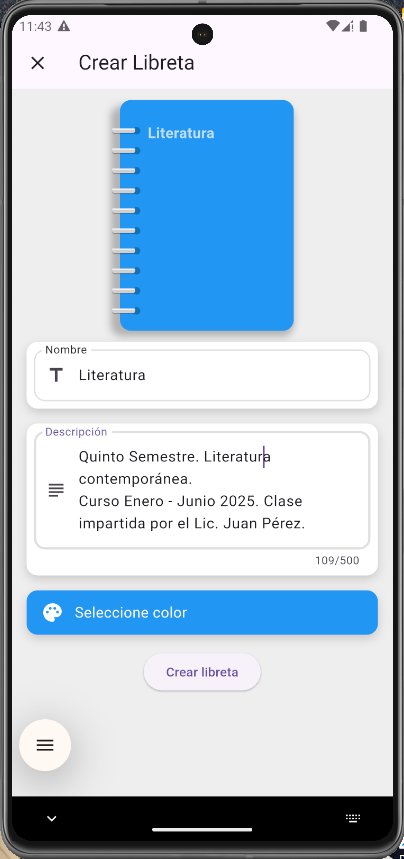
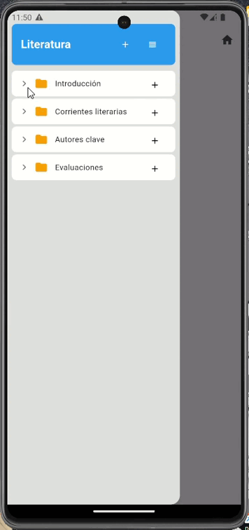

# 📓 CommonPlace Book

> **Estado del Proyecto:** En Desarrollo Activo 🏗️

_Una aplicación móvil para Android & iOS donde puedes gestionar tu vida en libretas, centralizando ideas, notas, tareas y conocimiento en un solo lugar._

**CommonPlace Book** digitaliza el concepto renacentista del "commonplace book": una colección personal de conocimiento, ideas, citas y descubrimientos. La app permite a los usuarios crear "Diarios" para anotaciones rápidas del día a día y "Libretas" especializadas con una estructura profunda de carpetas y páginas, ofreciendo un espacio único y organizado para toda la información importante de tu vida.

---

## Tabla de Contenidos
1. [Screenshots](#-screenshots)
2. [Características](#-características)
3. [Arquitectura del Software](#-arquitectura-del-software)
4. [Stack Tecnológico](#-stack-tecnológico)
5. [Instalación y Uso Local](#-instalación-y-uso-local)
6. [Desafíos y Aprendizajes](#-desafíos-y-aprendizajes)
7. [Contacto](#-contacto)

---

## 📸 Screenshots

## 📸 Screenshots

| Creación de Libreta | Vista de Libretas | Estructura de Contenido |
| :---: |:---:|:---:|
|  |  |  |


---

## ✨ Características

El estado actual del proyecto y las funcionalidades planeadas son las siguientes:

#### Implementado:
- [x] **Sistema de Libretas:** Gestión CRUD (Crear, Leer, Actualizar, Eliminar) completa para libretas y diarios.
- [x] **Organización Jerárquica (`Structure`):** Potente sistema para crear, editar, eliminar y reubicar carpetas y páginas dentro de una libreta. Permite anidación y reorganización intuitiva.
- [x] **Base de Datos Local Robusta:** Toda la información se almacena de forma segura y persistente en el dispositivo del usuario.
- [x] **Arquitectura Limpia y Escalable:** El núcleo de la aplicación está construido siguiendo los principios de la Arquitectura Hexagonal.

#### Próximamente / En Desarrollo:
- [ ] **Bloques de Contenido:** Desarrollo del editor de páginas para añadir distintos tipos de contenido: texto enriquecido, imágenes, listas de tareas (`To-Do`), eventos y recordatorios.
- [ ] **Homepage / Dashboard:** Una pantalla principal que mostrará un resumen de la actividad diaria, tareas pendientes, notas recientes y libretas más usadas.
- [ ] **Agregador de Tareas:** Una vista centralizada que recopilará todas las tareas pendientes de todas las libretas y diarios.
- [ ] **Funcionalidad de Diario:** Implementación específica para las notas del día a día, con una vista de calendario.
- [ ] **Backend y Sincronización en la Nube:** Migración a Firebase para permitir la sincronización entre dispositivos y copias de seguridad.

---

## 🏛️ Arquitectura del Software

Este proyecto no es solo una aplicación funcional, sino también un ejercicio de buenas prácticas de ingeniería de software. La base del código sigue estrictamente los principios de **Clean Architecture**, implementada a través de una **Arquitectura Hexagonal (Puertos y Adaptadores)**.

Esto significa que:
* **El código es Desacoplado y Cohesivo:** La lógica de negocio (dominio) es completamente independiente de la UI (Flutter), la base de datos (Drift/SQLite) y cualquier servicio externo.
* **Alta Testeabilidad:** La separación de responsabilidades facilita la creación de pruebas unitarias para la lógica de negocio sin depender de frameworks externos.
* **Escalabilidad y Mantenibilidad:** Añadir nuevas funcionalidades o cambiar una tecnología (como migrar de SQLite a Firebase) se puede hacer de forma mucho más sencilla y segura, ya que solo requiere la creación de un nuevo "adaptador" sin modificar el núcleo de la aplicación.

---

## 🛠️ Stack Tecnológico

| Categoría | Tecnología / Herramienta | Propósito |
|---|---|---|
| **Framework Móvil** | `Flutter` `Dart` | Desarrollo de la interfaz de usuario multiplataforma para Android & iOS. |
| **Base de Datos Local** | `Drift (SQLite)` | Gestor de base de datos reactivo, moderno y seguro para Flutter. |
| **Principios de Diseño**| `Clean Architecture` `SOLID` | Fundamentos para un código escalable, mantenible y robusto. |
| **Herramientas** | `Git` `GitHub` `Android Studio / VS Code`| Control de versiones y entorno de desarrollo. |

### Roadmap Tecnológico Futuro
- **Backend as a Service (BaaS):** `Firebase`
- **Autenticación:** `Firebase Auth`
- **Base de Datos en la Nube:** `Firebase Realtime Database` o `Firestore`
- **Almacenamiento de Archivos:** `Firebase Storage` para imágenes y documentos.

---

## ⚙️ Instalación y Uso Local

Para clonar y ejecutar este proyecto en tu entorno de desarrollo, sigue estos pasos:

**Requisitos:**
* Tener [Flutter SDK](https://docs.flutter.dev/get-started/install) instalado.
* Un emulador de Android o iOS, o un dispositivo físico.

**Pasos:**

1.  **Clona el repositorio:**
    ```bash
    git clone [https://github.com/tu-usuario/nombre-del-repo.git](https://github.com/tu-usuario/nombre-del-repo.git)
    cd nombre-del-repo
    ```

2.  **Obtén las dependencias del proyecto:**
    ```bash
    flutter pub get
    ```

3.  **Ejecuta la aplicación:**
    ```bash
    flutter run
    ```
    La aplicación se compilará y se ejecutará en tu emulador o dispositivo conectado. Como la app es 100% local, no se necesita ninguna configuración de variables de entorno.

---

## 🧠 Desafíos y Aprendizajes

* **El mayor desafío:** El reto más significativo y gratificante fue diseñar e implementar la aplicación siguiendo los patrones de **Clean Architecture**. Comprender a fondo los conceptos teóricos de Puertos y Adaptadores y los principios **SOLID** para luego traducirlos en código funcional en Flutter fue un proceso de aprendizaje intenso que ha fortalecido enormemente mis habilidades de diseño de software.

* **Principales aprendizajes:** Además de afianzar mi dominio de **Flutter** y el ecosistema de **Dart**, este proyecto ha sido una inmersión profunda en el manejo de bases de datos locales. A través de la librería `Drift`, he implementado conceptos clave como **migraciones** de esquema, **transacciones** para asegurar la integridad de los datos y la creación de consultas complejas y eficientes en **SQLite**.

---

## 📫 Contacto

¡Gracias por tomarte el tiempo de revisar mi proyecto! Si estás interesado en mi trabajo o simplemente quieres charlar sobre tecnología y desarrollo, no dudes en contactarme.

* **Email:** tim.ponce.08@ejemplo.com
